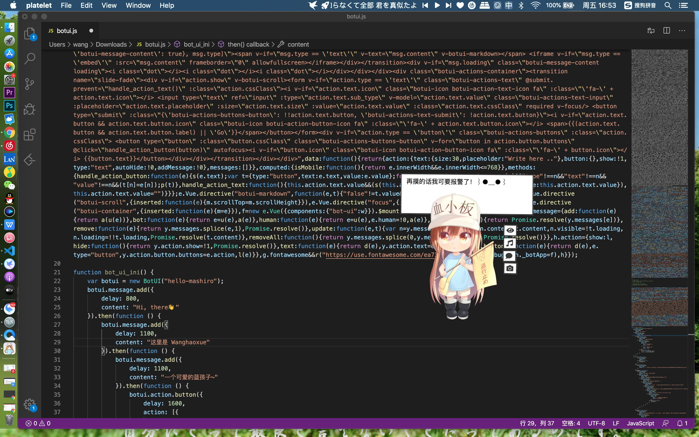

@wanghaoxue
website：wanghaoxue.com
## 支持的功能目前：
*可以瞬间截图然后保存在桌面，都是高清的哦
*提供互动交流
*播放 血小板之歌.MP3
*快捷切换主题-----例如对于macOS系统可以从亮色主题到深色主题
##  里面有啥呢：一个源代码文件 可以封装自由 另外一个来自某库 血小板的高清模型 可用于live2d 作者是个德国人

## Features

* toggle dark mode
* take photo
* play music

## Todo Features

* image hosting
